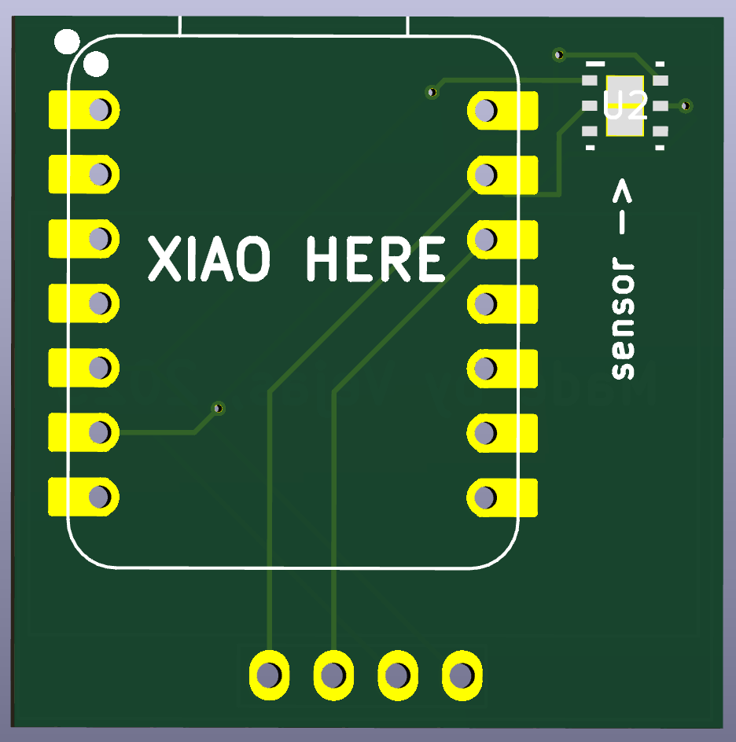
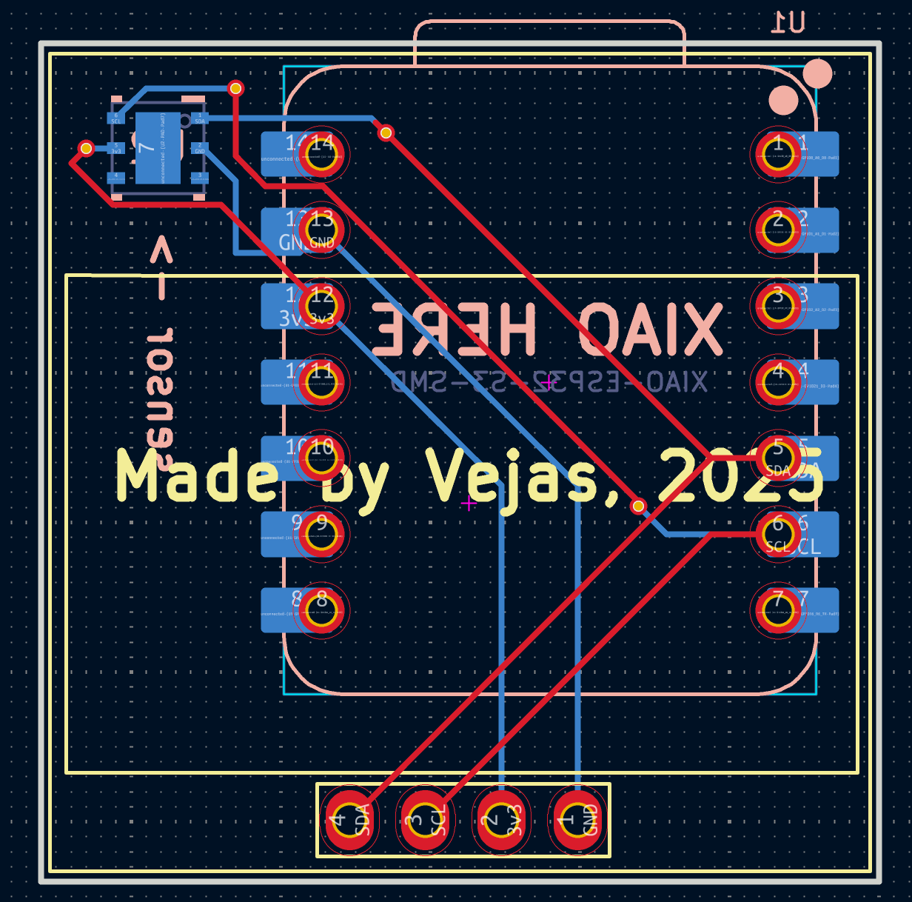
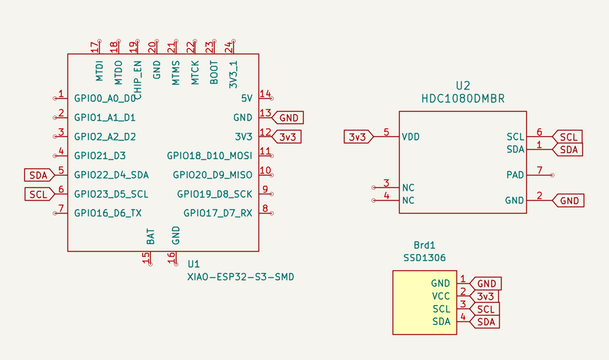

# August 29 13:30

I started this project and added an esp32-c6 seeed Xiao and a HDC1080DMBR temperature sensor.

 

## 14:20
I had the bright idea to add an oled display to show the temperature in real time.

 

## 15:30
Finished PCB and schematic.

 
 

## 17:10 

Noticed I need pull up resistors for my sensor.

# Total time: 2hrs