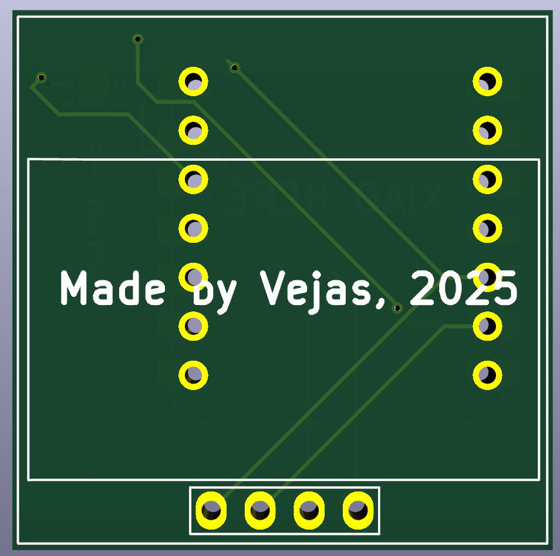
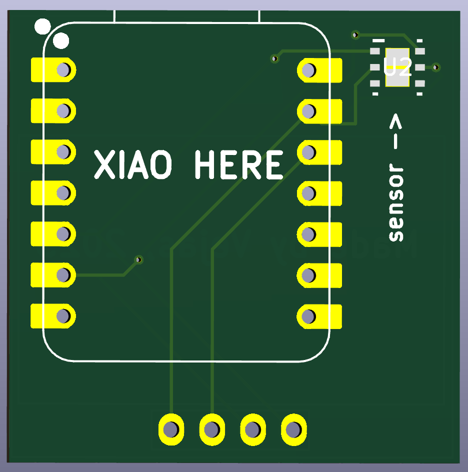
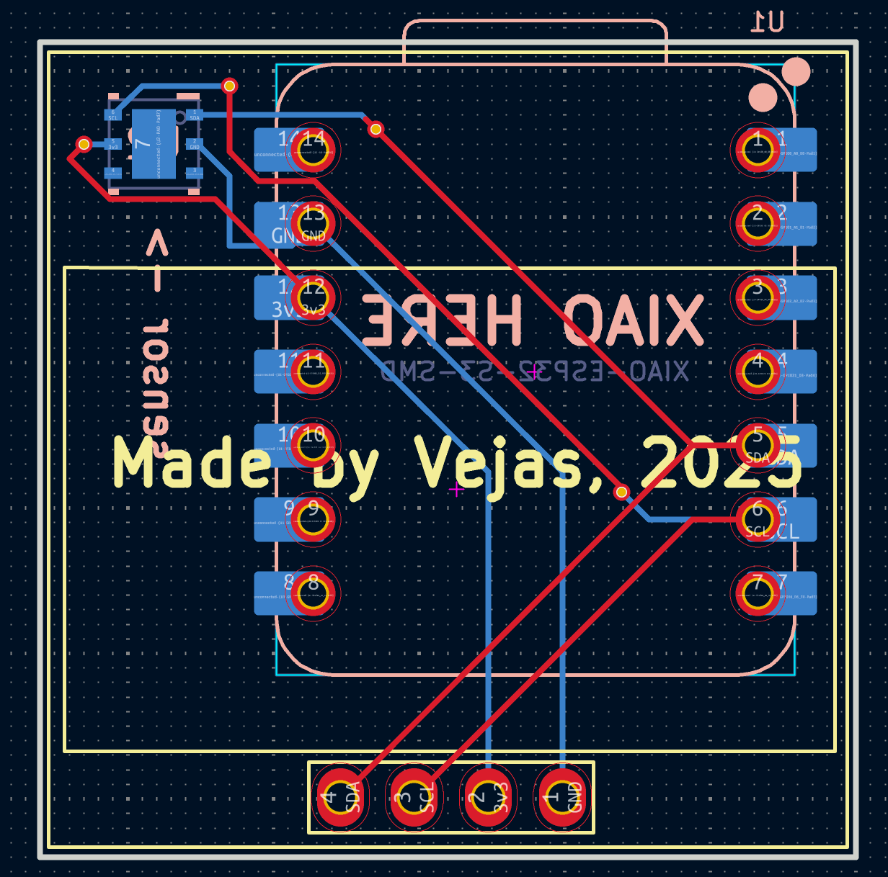

# ESP32-Temp-Sensor

This is a temperature sensor comprised of a Seeed Xiao ESP32-C6, a HDC1080DMBR temperature and humidity sensor and an OLED display.

I made the PCB in 2 hrs and tried to compact everything as well as possible.

## Pictures of PCB & Schematic

### PCB front

### PCB back

### PCB

### Schematic

